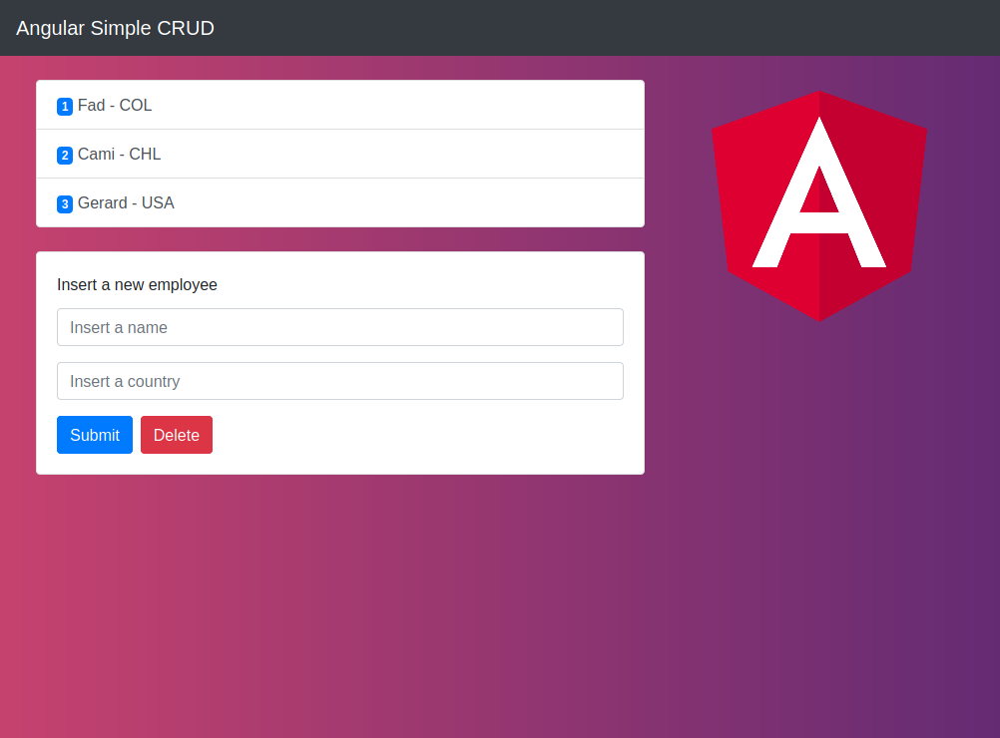
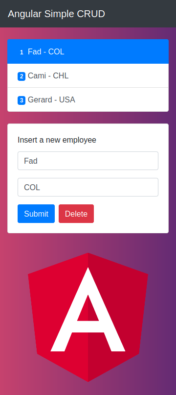

# Angular Simple CRUD

A simple app to create, remove and edit employees with name and country in a list

- The elements are saved in the localStorage to avoid loose data when reload

## Stack

- Angular
- Bootstrap

## Desktop view

## Mobile view

## Development server

Run `npm start` for a dev server. Navigate to `http://localhost:4200/`. The app will automatically reload if you change any of the source files.

## Build

Run `npm run build` to build the project. The build artifacts will be stored in the `dist/` directory. Use the `--prod` flag for a production build.

## Running unit tests

Run `npm run test` to execute the unit tests via [Karma](https://karma-runner.github.io).
